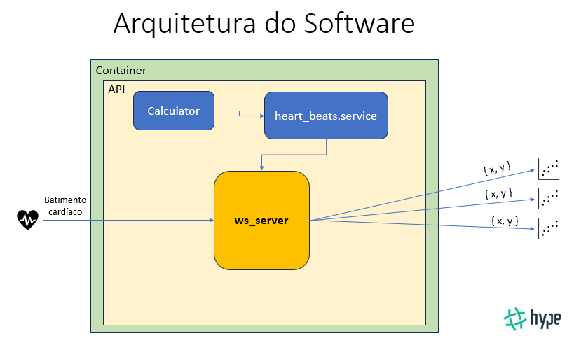

# HBM+ (Heart-beat monitor - Plus)

Este projeto consiste em desenvolver uma API como parte do processo de recrutamento e avaliação para a empresa [Hype Empreendimentos](https://hypeempreendimentos.com.br/).

## O teste

Foram passadas as seguintes intruções para arealização do test:

#### DESCRITIVO DA SOLUÇÃO
**Introdução**

A Acme® é uma empresa de tecnologia que desenvolve sistemas para diversos segmentos da indústria mundial e se preza pela utilização de formas inovadoras para a resolução de problemas ligados ao dia-a-dia das pessoas.

Sua tarefa será atuar em uma API de um dos produtos da Acme®, chamado HBM+ (Heart-beat monitor - Plus), que servirá para futuramente realizar análises de padrão de sinal de batimentos cardíacos de pacientes para futura análise preditiva de algumas doenças cardíacas.

**Exercício**

Seu trabalho como desenvolvedor Back-end será descrever visualmente a arquitetura da solução e desenvolver uma API que simula de forma <u>simplificada</u> o output de um destes dispositivos, levando em conta que as medições serão realizadas em <u>tempo real</u> e deverão possuir baixa latência em relação a quem acessa sua aplicação. Leve em conta que qualquer front-end deverá poder plotar um gráfico em tempo real recebendo dados constantemente de seu dispositivo em
um formato padronizado definido por você.

Utilize a seguinte fórmula como base para o output em que X é o tempo em milissegundos


**Entregas**
Será avaliado:

- Apresentação
    - Arquitetura da solução para atender os requisitos do problema
    - Explicação do código desenvolvido
    - Apresentação do protótipo em funcionamento

- Construção da API
    - Atendimento das regras de negócio descritas
    - Organização do código
    - Organização da estrutura da API
    - Utilização de boas práticas como tests, versionamento, documentação, cleanness e outras
    - Quaisquer outros critérios não pedidos que julgue importantes para a solução

- Servidor
    - Se o projeto possui um endpoint aberto que consegue receber dados do servidorem tempo real
    - Como você estrutura e configura o deployment do seu projeto, levando em conta ambientes, pipelines, etc
    - Como você lida com observabilidade da sua solução

- Não será avaliado
    - Linguagem de programação utilizada
    - A escolha do servidor em que o projeto roda
    - Latência decorrente de local geográfico

A entrega do exercício poderá ser feita através de um dos seguintes meios:
- Git aberto do projeto com seu usuário sendo o proprietário do repositório + link do
protótipo em funcionamento com instruções para acesso e uso no README
- Vídeo expositivo mostrando a solução e o código
- Apresentação em PowerPoint ou outra mídia semelhante mostrando a solução e o código


**Todos os dados desta prova são fictícios ou são de fontes abertas, servindo somente para a resolução desta prova.*

<br>

# Arquitetura

As principais partes da arquiterura são: Calculator, Service (heart_beats.service) e Server (ws_server).



## Descrição

- **Calculator**: É a função responsável por realizar o cálculo, atendendo a formula fornecida.

- **Service**: O service é responsável por manter o estado e executar o "Calculator". O calculator é recebido por injeção de dependência.

- **Server**: Consiste nas operações de inicializar os serviços WEB e WebSocket. O Server recebe [observador](https://learn.microsoft.com/pt-br/dotnet/standard/events/observer-design-pattern), que é o "Service". A cada batimento cardíaco o service é notificado.

## Fluxo

### Inicialização

Quando o sistema inicia, são executados os seguinte passos:

- É criado um server
- É criado um service, que recebe no constructor o respectivo calculator
- O service é registrado como observador no server

### Dados de input / output

- **input**: Os batimentos cardíacos são simulados por um agente externo, neste protótipo, o agente externo é um cliente WebSocket. Cada mensgem recebida de uma conexao de input, simula um batimento cardíaco.
    - Um **cliente de input** indica na URL de conexão (ws://url_servidor_api:3000?**operation=input**), seu papel de "input".
    As mensagens enviada devem ser com um payload em JSON contendo {"type": "beat"}. 
    A cada mensagem recebida/batimento cardíaco, são realizados os cálculos, e o resultado é enviado a todos os clientes de output.
- O **output** é um objeto JSON que contem x e y. **X** é o tempo em milisegundos entre o último batimento cardíaco e o anterior. **Y** é o valor resultante da fórmula em "Calculator".
    - Um **cliente de output** indica na URL de conexão (ws://url_servidor_api:3000?**operation=output**), seu papel de "output".
    A cada batimento cardíaco recebem um objeto JSON de **output**. O sistema suporta vários clientes de output.

<br>

# Tecnologias utilizadas

## Qualidade de Código

- **prettier**: Ferramenta de formatação de código que ajuda a manter a consistência e a legibilidade do código-fonte.
- **eslint**: Ferramenta de análise estática de código para JavaScript. Ela ajuda a identificar problemas e erros comuns no código, além de aplicar regras de estilo e boas práticas de programação.
- **husky**: Ferramenta para automatizar ganchos (hooks) do Git no Node.js. Ele permite que você defina scripts personalizados para serem executados em momentos específicos.
  - Neste projeto, antes do commit, está sendo checado:
    - O lint para o arquivos que estão em stage.
    - E roda todos os testes.
- **lint-stageg**: Permite executar linters de código apenas nos arquivos modificados em um determinado commit.
- **test coverage**: É uma métrica usada para medir a extensão em que o código de um programa é testado pelos casos de teste. Ele indica a porcentagem de código que é executado durante a execução dos testes automatizados. Neste projeto a cobertura de testes está em 100%.

## Regra de negocio

- **decimal.js**: Biblioteca JavaScript que oferece suporte a operações matemáticas precisas e manipulação de números decimais. Ela foi projetada para superar as limitações de aritmética de ponto flutuante do JavaScript padrão, que pode resultar em imprecisões em cálculos envolvendo números decimais.
- **node-input-validator**: Biblioteca para validação de entrada de dados em aplicativos Node.js. Ela fornece uma maneira simples e flexível de validar e sanitizar dados.

## Outras tecnologias

- **Express**: Framework para desenvolvimento de aplicações web em Node.js. Ele fornece uma camada de abstração sobre o servidor HTTP do Node.js.
- **NodeJS**: Ambiente de tempo de execução de código aberto baseado no motor JavaScript V8 do Google Chrome. Ele permite que você execute JavaScript no lado do servidor.
- **NPM**: Node Package Manager é o gerenciador de pacotes padrão para o ecossistema do Node.js. Ele permite que os desenvolvedores instalem, gerenciem e compartilhem pacotes de código reutilizáveis ​​(módulos) para seus projetos.
- **Jest**: Framework de teste de código aberto para JavaScript, projetado principalmente para testar aplicativos e bibliotecas do Node.js.
- **winston**: Biblioteca de registro (logging) para o Node.js. Ela fornece uma interface flexível e extensível para registrar mensagens e eventos nos aplicativos Node.js.
- **ts-node-dev**: É uma ferramenta que agiliza o desenvolvimento, pois economiza tempo e esforço ao automatizar o processo de reinicialização do servidor sempre que necessário.

# Instalação
Os e

## Obtendo o projeto
Passo 1: Clone o projeto. Na sua pasta de projetos execute o seguinte comando.

```
git clone https://github.com/martinmoraes/hbm.git
```

Passo 2: Instale as dependências. Na pasta raiz do projeto, execute os seguintes comando.

```
cd hbm
npm install
```

## Criação das variáveis de ambiente

Criar o arquivo **.env**, na raiz do projeto, com o seguinte conteudo

P.S.: A variável de ambiente "LOG_DIR" deve conter o path completo para a pasta "log", ou se o seu sistema operacional suportar LOG_DIR=~/log.

```
LOG_DIR=./log
PORT=3000
```

## Execução em modo de produção

Iniciar a aplicação - Ainda na pasta raiz do projeto execute o comando abaixo.

```
npm run start:prod
```

## Execução em modo desenvolvimento

Rodar o projeto - Certifique-se de estar na pasta raiz do projeto e execute o seguinte comando.

```
npm run start:dev
```

## Testar a API

Para testar a funcionalidade da API pode ser utilizado um dos seguintes meios: Postman, Simulador na API e Extensão do Chrome para WS.
A utilização dos três casos são mostrados no vídeo fazendo menção a URL em que a API está rodando.
Aqui mostraremos como testar rodando local.

### Postman
Para fazer requisições ws com o [Postman](https://www.postman.com/).

P.S.: Certifique-se da aplicação estar rodando na máquina local.

**input**:  
Crie um Request WebSocket.
1. Em URL coloque a URL abaixo e clique em Connext
```
ws://localhost:3000?operation=input
```
2. Em Message coloque
```
{
    "type": "beat"
}
```
3. Cada click em **send** funcionará como uma batida do coração.


**output**:  
Crie um Request WebSocket. Após conextar receberá os dados gerado pelo **input**

1. Em URL coloque a URL abaixo e clique em Connext
```
ws://localhost:3000?operation=output
```

<br>

# Testes

Os testes de unidade são uma prática de desenvolvimento de software em que unidades individuais de código são testadas para verificar se funcionam conforme o esperado.

- Para rodar todos os teste, certifique-se de estar na raiz do projeto e execute o seguinte comando:

```
npm run test
```

<br>

# Comandos

## Linter

Executa o ESLint e faz alterações nos arquivos. Estando na raiz do projeto execute o seguinte comando:

```
npm run lint:fix
```

## Prettier

Formata os arquivos JavaScript (com extensão .ts) no diretório 'src' e em todos dentro dele. Estando na raiz do projeto execute o seguinte comando:

```
npm run format
```

## Coverage

Verifica a cobertura de teste, Estando na raiz do projeto execute o seguinte comando:

```
npm run test:coverage
```


(http://89.116.212.179:3000/heart_beat_generator.html)[http://89.116.212.179:3000/heart_beat_generator.html]
(http://89.116.212.179:3000/heart_beat_receiver.html)[http://89.116.212.179:3000/heart_beat_receiver.html]
